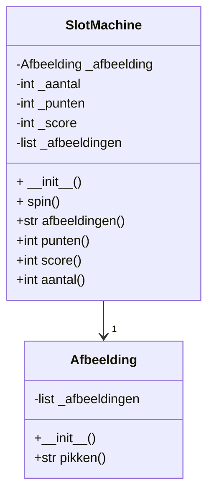

```mermaid
classDiagram
    class Afbeelding {
        -list _afbeeldingen
        +\_\_init\_\_()
        +str pikken()
    }

    class SlotMachine {
        -Afbeelding _afbeelding
        -int _aantal
        -int _punten
        -int _score
        -list _afbeeldingen
        + \_\_init\_\_()
        + spin()
        +str afbeeldingen()
        +int punten()
        +int score()
        +int aantal()
    }

    SlotMachine --> "1" Afbeelding
```